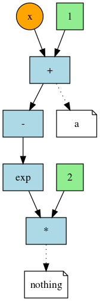

ReverseDiffSource internals
***************************

All the core of the functions in the package ( differentiation, removal of neutral statements, factorization of identical calls) rely on 2 structures:
	
	1. The ExNode composite type that represents either:
		- a single operation (a function call)
		- an external reference (a variable that can be a parameter for derivation or a reference to a variable outside the scope of the expression)
		- a constant
	ExNodes have parents which are typically the arguments of the function. Collectively they make a DAG but with several additions : 
		- the order of arguments (parent nodes) is significant ( ``a ^ b`` is not the same as ``b ^ a``)
		- there needs to be additionnal ordering information as statements not related sometimes need to execute in a specific order, this information is in the ``precedence`` field.
	2. The ExGraph composite type that stores
		- ExNodes in a vector (in the order of execution), 
		- information on how to map ExNodes to variable names (used and set), 
		- and optionnaly information on how to map nodes to 'outer' nodes. This last mapping is necessary when the ExGraph is embedded in another parent graph ( for example the inner scope of ``for`` loops is represented as a subgraph). 

Showing the code graph
^^^^^^^^^^^^^^^^^^^^^^

Starting from an expression, it is possible to have a dump of the nodes composing its equivalent graph with the (unexported) ``tograph()`` call :

	ex = quote
		a = 1 + x
		2 * exp(-a)
	end

	g = ReverseDiffSource.tograph(ex)
	
	node | symbol     | ext ? | type       | parents  | precedence | main  | value         | 
	---- | ---------- | ----- | ---------- | -------- | ---------- | ----- | ------------- | 
	1    |            |       | [constant] |          |            | 1     | (Float64) NaN | 
	2    | x >>       |       | [external] |          |            | :x    | (Float64) NaN | 
	3    | a <<       |       | [call]     | 11, 1, 2 |            | :call | (Float64) NaN | 
	4    |            |       | [constant] |          |            | 2     | (Float64) NaN | 
	5    |            |       | [call]     | 8, 3     |            | :call | (Float64) NaN | 
	6    |            |       | [call]     | 10, 5    |            | :call | (Float64) NaN | 
	7    | nothing << |       | [call]     | 9, 4, 6  |            | :call | (Float64) NaN | 
	8    |            |       | [constant] |          |            | -     | (Float64) NaN | 
	9    |            |       | [constant] |          |            | *     | (Float64) NaN | 
	10   |            |       | [constant] |          |            | exp   | (Float64) NaN | 
	11   |            |       | [constant] |          |            | +     | (Float64) NaN | 

Additionnaly, the ``plot()`` function (also unexported) will generate a GrapViz compatible graph description :

	using GraphViz

	Graph( ReverseDiffSource.plot( g ))
	
Should produce : 

